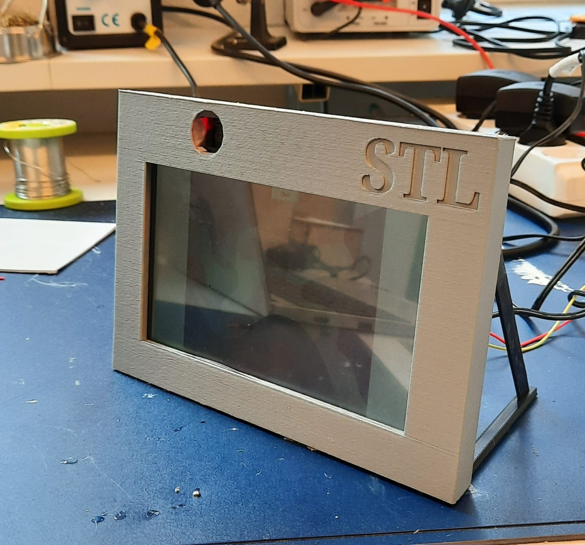
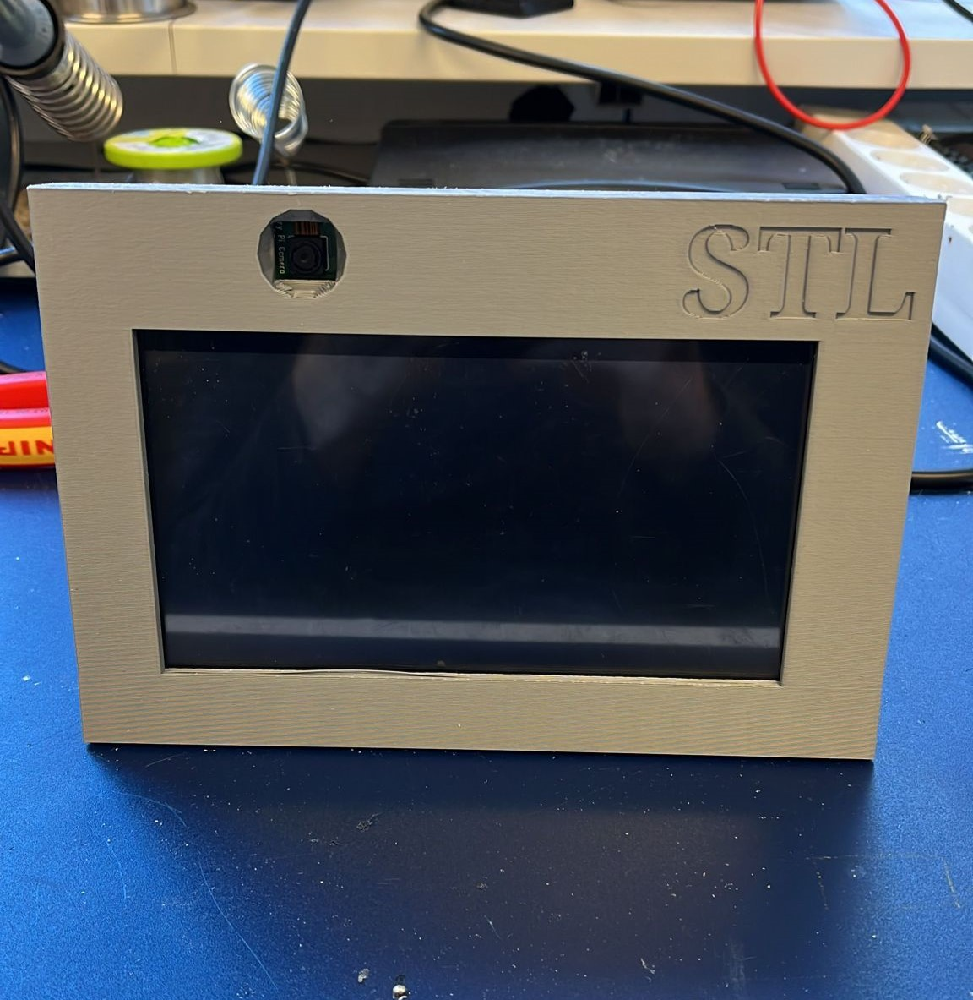

# Multimodal Smart Picture Frame Project

 

This is a project to create a digital picture frame that takes user input in unconventional ways.

- Face detection: used to "rate" the shown image. It works by increasing the image score while the user is looking at the image.
- Hand tracking: perform a swipe gesture to go to the next/previous image in the rotation
- Shake: shake the picture frame to go to the next image
- Touch: uses the Bare Conductive "Pi Cap" to enable touch input on the sides of the frame. (The touchscreen on the picture-frame was deliberately avoided to create more of a challenge)
- Scoring: images have a rating that drives their selection in the image rotation. Images with a higher score are more likely to be shown in the slideshow

## Install

First, clone the repo.

```sh
pip3 install virtualenv
python3 -m virtualenv venv
source venv/bin/activate
pip3 install -r requirements-pi.txt
```

Also, for the Alexa integration you probably want to set up ngrok.

```sh
curl -s https://ngrok-agent.s3.amazonaws.com/ngrok.asc | sudo tee /etc/apt/trusted.gpg.d/ngrok.asc >/dev/null && echo "deb https://ngrok-agent.s3.amazonaws.com buster main" | sudo tee /etc/apt/sources.list.d/ngrok.list && sudo apt update && sudo apt install ngrok
ngrok config add-authtoken <token>
```

You get your token from your [account's dashboard](https://dashboard.ngrok.com).

## Usage

```sh
flask run
ngrok http 5000 # or whatever port is used
```
